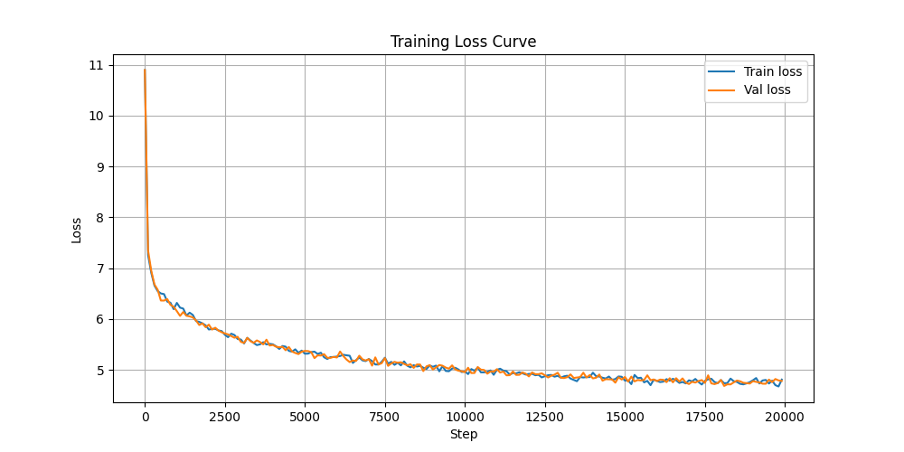

# GPT Language Model — From Scratch

A GPT-style transformer language model built from scratch in PyTorch, without using any pretrained models or high-level AI libraries. Every component of the architecture was implemented manually, pretrained on the OpenWebText corpus across multiple versions from a bigram baseline to a full transformer with BPE tokenization, mixed precision training and top-k sampling.

---

## What I Built

This is a decoder-only transformer architecture — the same design that powers GPT-2 and GPT-3 — implemented entirely from first principles. No `transformers` library, no pretrained weights. Just PyTorch and math.

The model learns to generate coherent English text by predicting the next token given the previous context, trained on millions of real web pages.

---

## Architecture

| Component | Details |
|---|---|
| Architecture | Decoder-only Transformer (GPT-style) |
| Attention | Multi-head causal self-attention |
| Layers | 8 transformer blocks |
| Attention heads | 8 |
| Embedding dimension | 384 |
| Context length | 128 tokens |
| Tokenization | Byte Pair Encoding (BPE) via tiktoken |
| Vocab size | 50,257 subword tokens |
| Activation | GELU |
| Normalization | Pre-LayerNorm |
| Parameters | ~53M |

### Components built from scratch:
- **Multi-head causal self-attention** with scaled dot-product attention and triangular causal mask
- **Positional embeddings** — learned position vectors added to token embeddings
- **Residual connections** — `x = x + attention(x)` for stable gradient flow
- **Layer normalization** — Pre-LN style (normalize before attention, not after)
- **Feed-forward network** — 4x expansion with GELU activation
- **Weight initialization** — Normal distribution with std=0.02
- **Weight tying** — shared weights between input embeddings and output projection
- **Cosine learning rate schedule** with linear warmup
- **Gradient clipping** for training stability
- **Top-k sampling with temperature** for quality text generation

---

## Training

- **Dataset:** OpenWebText — an open-source replication of the dataset used to train GPT-2, sourced from Reddit-linked web pages (~40GB total, ~12GB sampled at 30%)
- **Tokenization:** Byte Pair Encoding (BPE) via tiktoken — same tokenizer as GPT-2
- **Hardware:** NVIDIA RTX 5070 Laptop GPU (CUDA)
- **Optimizer:** AdamW (lr=3e-4, cosine decay with linear warmup)
- **Steps:** 20,000
- **Precision:** Automatic Mixed Precision (AMP) via torch.amp
- **Final loss:** 4.65

### Loss Curve


Smooth consistent decline from 11.0 → 4.65 over 20,000 steps with train and val loss tracking closely throughout — no overfitting. Steep initial drop reflects fast early learning from the cosine warmup schedule.

---

## Versions

| Version | Tokenization | Layers | Loss | Notes |
|---|---|---|---|---|
| v1 | Character-level | 1 | 2.34 | Bigram baseline |
| v2 | Character-level | 8 | 1.41 | Full transformer, GELU, Pre-LN |
| v3 | BPE (tiktoken) | 8 | 4.77 | Word-level tokens, cosine LR, gradient clipping |
| v4 | BPE (tiktoken) | 8 | 4.65 | Weight tying, AMP, top-k sampling, 20k steps |

> Note: v2 and v3/v4 losses are not directly comparable — BPE has a vocabulary of 50,257 tokens vs ~17,000 characters, so random baseline loss is ~10.8 vs ~9.8. v4 represents significantly more learned structure per token.

---

## Sample Output

**v2 — Character-level (loss 1.41):**
```
The community of Fadder Brover in expeating Change Canada, big as 
best-two-challenge of campaign partically breakly, letter their political 
appletations five. Scorpor lices asked amongment party.
```

**v3 — BPE (loss 4.77):**
```
Over the years the Orasard, who briefly pledged that conspiracy to support 
the meaning, gave a theological eyes, saying "aren't after anything, 
[the destruction of business liberty] to defend Jeremy signing in fighting 
the truth about it."
```

**v4 — BPE with top-k sampling (loss 4.65):**
```
In April, of the study conducted by the International Times from the Institute 
for Environmental Energy Research, the University of America, and the 
Environmental Protection Agency (ICP) in the United States.

In a group of patients with the University of Michigan, a handful of students 
and college students were among the schools at the University of California.

"I know her and her father have been with so much as many as the school's and 
her daughter's family, because she's going to get her to work for her," she says. 
"She's going to have to work with the children at home."
```

Clear progression from character-level gibberish to coherent English paragraphs with realistic institutions, proper attribution, and natural dialogue formatting.

---

## Project Structure

```
gpt-from-scratch/
├── gpt-v2.ipynb        # Character-level transformer
├── gpt-v3.ipynb        # BPE transformer with cosine LR and gradient clipping
├── gpt-v4.ipynb        # Full pipeline with AMP, weight tying and top-k sampling
├── training.py         # Standalone training script with argparse
├── chatbot.py          # Interactive text generation interface
├── data-extract.py     # OpenWebText data extraction and preprocessing
├── loss_curve.png      # Training loss visualization
└── vocab.txt           # Character vocabulary (v2)
```

---

## How to Run

### Setup
```bash
# Create virtual environment
python -m venv venv
venv\Scripts\activate  # Windows

# Install dependencies
pip install torch --index-url https://download.pytorch.org/whl/cu128
pip install datasets tqdm matplotlib tiktoken
```

### Extract training data
```bash
python data-extract.py
```
This downloads OpenWebText via Hugging Face and generates `output_train.txt` and `output_val.txt`.

### Train the model
```bash
python training.py --max_iters 20000 --n_layer 8 --n_head 8
```

### Generate text interactively
```bash
python chatbot.py
```

---

## Key Technical Decisions

**Why BPE over character-level tokenization?**
Character-level tokenization requires the model to learn spelling before it can learn meaning. BPE encodes common words as single tokens so the model operates at the word level from the start. A context window of 128 BPE tokens covers a full paragraph vs just a few words at character level.

**Why weight tying?**
Sharing weights between the input embedding table and the output projection reduces parameters while improving performance — the model uses the same representation for understanding tokens as for predicting them. This technique is used in GPT-2 and most modern language models.

**Why automatic mixed precision?**
FP16 operations are significantly faster on modern GPUs. AMP automatically uses FP16 where safe and FP32 where precision is needed, giving a ~40% training speedup with no loss in quality. Gradient scaling prevents underflow in FP16 gradients.

**Why top-k sampling with temperature?**
Pure sampling from the full vocabulary distribution often picks low-probability tokens that produce incoherent output. Top-k filtering restricts sampling to only the k most likely tokens, eliminating long-tail nonsense. Temperature controls the sharpness of the distribution — lower values produce more focused output, higher values produce more creative and varied text.

**Why train from scratch instead of fine-tuning?**
The goal was to understand the full pretraining pipeline — how a model goes from random weights to generating coherent text purely through next-token prediction on raw text data.

**Why OpenWebText?**
It's the standard open-source replication of the dataset used to train GPT-2, making results more comparable to published work than a toy dataset.

---

## What I Learned

- How transformer self-attention works mechanically — Q, K, V projections, scaled dot-product, causal masking
- Why residual connections and layer normalization are essential for training deep networks
- The full pretraining pipeline from raw text to a trained language model
- The difference between character-level and subword tokenization and how it affects what the model can learn
- Why weight tying works and how shared representations improve language model performance
- How automatic mixed precision training works and when to use FP16 vs FP32
- How top-k and temperature sampling affect generation quality and diversity
- CUDA debugging — device-side asserts, embedding table mismatches, memory management
- Memory-mapped file I/O for training on datasets too large to fit in RAM
- Training stability techniques — gradient clipping, learning rate scheduling, model checkpointing
- Crash recovery from saved checkpoints during long training runs

---

## References

- [Attention Is All You Need](https://arxiv.org/abs/1706.03762) — Vaswani et al. (2017)
- [Language Models are Unsupervised Multitask Learners](https://cdn.openai.com/better-language-models/language_models_are_unsupervised_multitask_learners.pdf) — GPT-2 paper
- [OpenWebText Corpus](https://skylion007.github.io/OpenWebTextCorpus/)
- Andrej Karpathy's [nanoGPT](https://github.com/karpathy/nanoGPT) — architectural reference